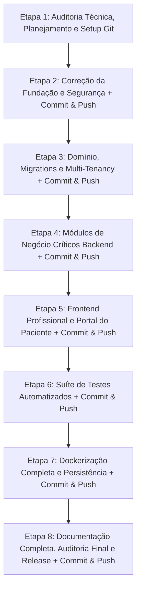

# 🗺️ PLANO DE IMPLEMENTAÇÃO E EVOLUÇÃO — SAAS ELLO SAÚDE

**Objetivo:** Transformar o projeto ElloSaúde existente em uma solução SaaS multi-tenant comercializável para clínicas e consultórios, segura (LGPD), testada e pronta para produção no Docker Desktop.

---

## 1. PRINCÍPIOS E DIRETRIZES DO PLANO

1. **Preservação Arquitetural:** Manter a Clean Architecture (.NET 9 + C#), o padrão CQRS (MediatR), o EF Core com SQL Server e o frontend em Vue 3 (PrimeVue).
2. **Priorização Rígida:**
   - **Prioridade 1:** Segurança, isolamento multi-tenant, validação de integridade e fundação técnica.
   - **Prioridade 2:** Implementação dos módulos de negócio reais faltantes (Receituário/PDF, Financeiro real com formas de pagamento e consultas de retorno, Portal do Paciente, Disponibilidade de Agenda).
   - **Prioridade 3:** Prontuário médico com integridade e auditoria (LGPD/CFM).
   - **Prioridade 4:** Frontend profissional integrado, responsivo e com experiência SaaS moderna.
   - **Prioridade 5:** Bateria de testes automatizados (unitários, integração e isolamento multi-tenant).
   - **Prioridade 6:** Orquestração Docker completa (Front + API + DB + Volumes persistentes + Healthchecks).
   - **Prioridade 7:** Documentação exaustiva e preparação para produção.
3. **Não Destrutividade:** Não apagar migrações existentes indiscriminadamente; criar migrações incrementais organizadas.
4. **Governança Git Rígida:** Nenhum código avançará para a próxima etapa sem testes passando, commit semântico estruturado e sincronização via push com o repositório do GitHub.

---

## 2. ESTRATÉGIA DE VERSIONAMENTO GIT, COMMITS E SINCRONIZAÇÃO GITHUB

### 2.1. Estrutura do Repositório Monorepo
O projeto engloba o backend (`ElloSaudeAPI`), o frontend (`ElloSaudeWeb`), a documentação (`docs/`) e os artefatos de infraestrutura Docker em uma única raiz (`ClinicaProjeto`).
- **Raiz do Git:** Inicializada na raiz `ClinicaProjeto`.
- **Eliminação de `.git` aninhado:** Remover qualquer pasta `.git` interna em `ElloSaudeWeb` para evitar problemas de submodule indesejado.
- **Arquivo `.gitignore` Global Unificado:** Ignorar binários compilados (`bin/`, `obj/`), dependências de Node (`node_modules/`, `dist/`), cache do Visual Studio (`.vs/`), logs e arquivos de segredos locais (`.env`).
- **Branch Principal:** `main` (ou branch de desenvolvimento `develop` acordada).

### 2.2. Padrão de Mensagens de Commit (Conventional Commits)
Cada commit seguirá o padrão internacional da indústria:
- `docs: <descrição>` — Para atualizações de relatórios e documentação técnica.
- `fix: <descrição>` — Para correções de bugs, segurança ou tratamento de exceções.
- `feat: <descrição>` — Para inclusão de novas entidades, regras de negócio ou telas.
- `test: <descrição>` — Para novos testes unitários ou de integração.
- `refactor: <descrição>` — Para melhorias de design de código sem alteração funcional.
- `chore: <descrição>` — Para configurações de build, Docker, dependências ou scripts.

### 2.3. Protocolo Obrigatório de Conclusão de Cada Etapa
Ao finalizar cada etapa do plano, o seguinte fluxo deve ser executado obrigatoriamente:
1. **Validação de Integridade:** Rodar `dotnet test` e `npm run build` para garantir zero quebras.
2. **Revisão de Arquivos Modificados:** `git status` e verificação de arquivos sensíveis (garantir que nenhum `.env` com senhas reais seja comitado).
3. **Stage:** `git add .`
4. **Commit Semântico:** `git commit -m "<tipo>(<escopo>): <descrição detalhada das entregas da etapa>"`
5. **Push para o GitHub:** `git push origin <branch>`
6. **Registro no Relatório da Etapa:** Incluir o hash do commit e status do push no relatório da etapa.

---

## 3. CRONOGRAMA DE ETAPAS E SPRINT BACKLOG

---

## 4. DETALHAMENTO DAS ETAPAS COM COMMITS E PUSH

### ETAPA 1 — AUDITORIA TÉCNICA, PLANEJAMENTO E SETUP DO GIT
**Objetivo:** Auditar 100% do código existente, documentar o estado atual e estruturar o repositório Git unificado.

- [x] **1.1. Auditoria Completa:** Inspecionar backend, frontend, persistência, docker, segurança e testes.
- [x] **1.2. Documento de Auditoria Técnica:** Criação do arquivo `docs/AUDITORIA_TECNICA.md`.
- [x] **1.3. Documento do Plano de Implementação:** Criação e enriquecimento do `docs/PLANO_DE_IMPLEMENTACAO.md`.
- [ ] **1.4. Setup do Repositório Git e GitHub:**
  - Criar `.gitignore` global unificado na raiz do projeto.
  - Remover `.git` aninhado da pasta `ElloSaudeWeb`.
  - Inicializar git na raiz (`git init`), configurar branch principal `main`.
  - Configurar remote do GitHub (`git remote add origin <url-do-repositorio>`).
- [ ] **1.5. Commit e Push da Etapa 1:**
  - `git add .`
  - `git commit -m "docs(audit): entrega da auditoria tecnica completa, plano de implementacao e setup do monorepo"`
  - `git push -u origin main`

---

### ETAPA 2 — CORREÇÃO DA FUNDAÇÃO TÉCNICA E SEGURANÇA
**Objetivo:** Eliminar vulnerabilidades críticas, padronizar respostas e garantir que regras de validação sejam efetivamente executadas.

- [ ] **2.1. Pipeline de Validação Automática (FluentValidation):**
  - Implementar `ValidationBehavior<TRequest, TResponse>` como pipeline do MediatR.
  - Registrar todos os validadores da camada `Application`.
  - Retornar erros de validação padronizados automaticamente antes da execução dos handlers.
- [ ] **2.2. Tratamento Global de Erros com Problem Details (RFC 7807):**
  - Refatorar `ExceptionMiddleware` para retornar `ValidationProblemDetails` em erros 400.
  - Tratar `KeyNotFoundException` (404), `UnauthorizedAccessException` (403), `InvalidOperationException` (409 Conflito) e exceções não tratadas (500 com mensagem segura e log interno).
- [ ] **2.3. Blindagem de JWT e CORS:**
  - Configurar chave JWT segura via variáveis de ambiente com fallback restrito a ambiente de desenvolvimento.
  - Validar `Issuer`, `Audience` e tempo de expiração do token.
  - Configurar CORS com políticas restritas e suporte a origens configuráveis.
- [ ] **2.4. Health Checks e Observabilidade:**
  - Adicionar `builder.Services.AddHealthChecks()` com verificação do SQL Server.
  - Mapear endpoint `/health` e `/health/ready`.
- [ ] **2.5. Commit e Push da Etapa 2:**
  - Testes: executar `dotnet test ElloSaude.sln`.
  - `git add .`
  - `git commit -m "fix(security): correcao do middleware problem details, pipeline fluentvalidation, seguranca jwt e healthchecks"`
  - `git push origin main`

---

### ETAPA 3 — MODELAGEM DE DOMÍNIO, MULTI-TENANCY E PERSISTÊNCIA
**Objetivo:** Estruturar as entidades que estão ausentes ou incompletas e versionar o esquema do banco de dados.

- [ ] **3.1. Evolução das Entidades Existentes:**
  - `BaseEntity`: Adicionar `CreatedAt`, `UpdatedAt`, `IsDeleted`.
  - `Patient`: Adicionar telefone, endereço, contato de emergência, sexo, status ativo/inativo.
  - `Appointment`: Adicionar valor previsto, tipo de cobrança (Normal vs Retorno Gratuito), observações, histórico de status e motivo de cancelamento.
  - `MedicalRecord`: Transformar em registro com integridade imutável; adicionar entidade filha `MedicalRecordAddendum` para retificações e anotações posteriores sem sobrescrita.
- [ ] **3.2. Novas Entidades de Domínio:**
  - `Professional`: CRM, estado do conselho, especialidade, telefone, vínculo com clínica/usuário.
  - `DoctorAvailability` & `ScheduleBlock`: Dias da semana de atendimento, horário de início/fim, intervalo para almoço, duração padrão da consulta e bloqueios temporários (férias, congressos).
  - `Prescription` & `PrescriptionItem`: Paciente, profissional, data, instruções gerais, lista de medicamentos (nome, concentração, posologia, duração, via de administração) e status.
  - `PaymentRecord` / `FinancialTransaction`: Agendamento/consulta relacionada, valor previsto, valor pago, data de pagamento, forma de pagamento (Pix, Dinheiro, Cartão Débito, Cartão Crédito, Transferência), status (Pendente, Pago, Cancelado, Gratuito/Retorno), operador que registrou.
  - `AuditLog`: TenantId, UserId, Ação (Leitura/Criação/Modificação), EntidadeAfetada, RegistroId, Timestamp, Endereço IP.
- [ ] **3.3. Multi-Tenancy e DbContext:**
  - Ajustar o Global Query Filter em `ApplicationDbContext` para utilizar expressão segura que avalie dinamicamente o tenant por requisição.
  - Preencher automaticamente `TenantId`, `CreatedAt` e `UpdatedAt` no `SaveChangesAsync`.
- [ ] **3.4. Criação e Aplicação de Migrations Versionadas:**
  - Substituir o uso de `EnsureCreatedAsync()` por `MigrateAsync()` no início da aplicação.
  - Gerar a migration oficial: `AddCompleteSaasClinicalSchema`.
- [ ] **3.5. Commit e Push da Etapa 3:**
  - Testes: executar `dotnet test ElloSaude.sln`.
  - `git add .`
  - `git commit -m "feat(domain): expansao do modelo de dados para saas clinico, multi-tenancy robusto e migrations versionadas"`
  - `git push origin main`

---

### ETAPA 4 — IMPLEMENTAÇÃO DOS MÓDULOS DE NEGÓCIO NO BACKEND
**Objetivo:** Desenvolver a lógica dos casos de uso, regras de conflito de agenda, emissão de PDF e financeiro real.

- [ ] **4.1. Módulo de Agenda & Disponibilidade:**
  - Caso de uso para cadastrar e consultar disponibilidade semanal e bloqueios de agenda dos médicos.
  - Validação estrita em `CreateAppointmentCommand`:
    - Impedir agendamento fora do horário de atendimento configurado.
    - Impedir conflito/sobreposição de horário do mesmo médico.
    - Impedir agendamento duplicado para o mesmo paciente no mesmo horário.
- [ ] **4.2. Módulo de Consultas e Prontuário Clínico Imutável:**
  - Registro de atendimento médico vinculado ao agendamento.
  - Endpoint de consulta de prontuário com validação de permissão: acesso exclusivo para profissionais de saúde autorizados. Bloqueio absoluto para perfil Secretária na API.
  - Remoção de deleção física de prontuário.
  - Registro de log de auditoria no acesso ao prontuário (`AuditLog`).
- [ ] **4.3. Módulo de Receituário Eletrônico & Emissão de PDF:**
  - Comandos para criar e finalizar receitas vinculadas a consultas.
  - Integração com biblioteca de geração de PDF compatível com Linux/Docker (QuestPDF).
  - Endpoint seguro de download de receita (`GET /api/prescriptions/{id}/pdf`) com validação de autorização (apenas médico emissor, clínica e o paciente titular).
- [ ] **4.4. Módulo Financeiro Real:**
  - Comandos para registrar recebimento de consulta (`RegisterPaymentCommand`), estorno ou marcação de retorno gratuito (`MarkAsFreeReturnCommand`).
  - Queries para relatórios financeiros reais:
    - Total recebido por período.
    - Total pendente.
    - Faturamento por profissional.
    - Total por forma de pagamento (Pix, Cartão, Dinheiro).
    - Consultas de retorno sem cobrança.
- [ ] **4.5. Módulo do Portal do Paciente (API):**
  - Endpoints dedicados para o paciente autenticado:
    - `GET /api/patient-portal/my-appointments`: Próximos compromissos e histórico.
    - `POST /api/patient-portal/book`: Agendamento seguro com validação de horários livres.
    - `POST /api/patient-portal/cancel/{id}`: Cancelamento pelo paciente dentro das regras da clínica.
    - `GET /api/patient-portal/my-prescriptions`: Listagem e download de receitas liberadas.
- [ ] **4.6. Commit e Push da Etapa 4:**
  - Testes: executar `dotnet test ElloSaude.sln`.
  - `git add .`
  - `git commit -m "feat(api): implementacao de receitas pdf, financeiro real com retornos, agenda sem conflitos e portal paciente"`
  - `git push origin main`

---

### ETAPA 5 — FRONTEND PROFISSIONAL (VUE 3 + PRIMEVUE)
**Objetivo:** Atualizar telas existentes, criar os módulos ausentes e proporcionar uma interface SaaS moderna, ágil e responsiva.

- [ ] **5.1. Design System & Navegação:**
  - Sidebar dinâmica que se adapta à role do usuário (Secretária, Profissional, Admin, Paciente).
  - Correção no interceptor do `axios.js` para redirecionamento correto em 401 para `/auth/login`.
- [ ] **5.2. Aprimoramento da Agenda:**
  - Seleção explícita do médico responsável no modal de agendamento.
  - Filtro da agenda por profissional de saúde.
  - Bloqueio visual e indicação de horários disponíveis.
- [ ] **5.3. Módulo de Prescrições e Receitas:**
  - Formulário dinâmico para adicionar medicamentos, concentrações e posologias.
  - Botão de visualização e download do PDF gerado.
- [ ] **5.4. Módulo Financeiro Completo:**
  - Interface com filtros por período e profissional.
  - Tabela detalhada de transações financeiras com status (Pago, Pendente, Retorno Gratuito).
  - Modal para registro de pagamento informando método (Pix, Dinheiro, Cartão).
- [ ] **5.5. Portal do Paciente:**
  - Layout limpo e responsivo para o paciente.
  - Visualização de próximos agendamentos e botão de agendar com seleção de especialidade, médico e horário vago.
  - Aba de receitas liberadas com botão de download do PDF.
- [ ] **5.6. Gestão de Equipe e Configurações:**
  - Tela de gestão de profissionais (cadastro de CRM, horários de atendimento).
  - Tela de configurações da clínica e usuários.
- [ ] **5.7. Commit e Push da Etapa 5:**
  - Build: executar `npm run build` em `ElloSaudeWeb`.
  - `git add .`
  - `git commit -m "feat(frontend): novo portal do paciente, emissao de receitas, financeiro profissional e agenda dinamica"`
  - `git push origin main`

---

### ETAPA 6 — SUÍTE DE TESTES AUTOMATIZADOS OBRIGATÓRIOS
**Objetivo:** Comprovar a segurança, isolamento multi-tenant e robustez das regras de negócio.

- [ ] **6.1. Testes Unitários de Negócio:**
  - Criação de agendamentos e bloqueio por sobreposição de horários.
  - Validação de retorno gratuito (sem geração de valor a receber).
  - Cálculos financeiros e somatórios por forma de pagamento.
  - Imutabilidade do prontuário médico.
- [ ] **6.2. Testes de Integração & Isolamento Multi-Tenant:**
  - Teste automatizado comprovando que um usuário da Clínica A **não consegue** visualizar ou alterar pacientes, agendamentos, prontuários ou financeiro da Clínica B, mesmo alterando IDs na requisição.
  - Teste comprovando que usuário com perfil Secretária recebe HTTP 403 Forbidden ao tentar acessar `/api/medicalrecords`.
  - Teste comprovando que um paciente não acessa dados nem receitas de outros pacientes.
- [ ] **6.3. Commit e Push da Etapa 6:**
  - Execução total da suíte: `dotnet test ElloSaude.sln --logger "console;verbosity=detailed"`.
  - `git add .`
  - `git commit -m "test(coverage): suite completa de testes de isolamento multi-tenant, regras de conflito de agenda e financeiro"`
  - `git push origin main`

---

### ETAPA 7 — AMBIENTE DOCKER DESKTOP E PRODUÇÃO
**Objetivo:** Permitir a subida imediata do ecossistema com um único comando no Docker Desktop.

- [ ] **7.1. Dockerfile do Frontend:**
  - Build multi-stage com Node 20 para compilação e Nginx Alpine para servir o SPA com roteamento correto.
- [ ] **7.2. Docker Compose Unificado:**
  - Serviços orquestrados: `sqlserver`, `rabbitmq`, `api`, `web`.
  - Volume persistente nomeado para dados do banco (`sqlserver_data:/var/opt/mssql/data`).
  - Healthcheck no SQL Server (`sqlcmd -Q "SELECT 1"`) para que a API aguarde o banco estar saudável antes de iniciar (`condition: service_healthy`).
  - Arquivos `.dockerignore` e `.env.example`.
- [ ] **7.3. Commit e Push da Etapa 7:**
  - Teste: subir containers com `docker compose up --build -d` e validar conectividade.
  - `git add .`
  - `git commit -m "chore(docker): docker compose unificado com persistencia de dados, healthchecks e frontend nginx"`
  - `git push origin main`

---

### ETAPA 8 — DOCUMENTAÇÃO TÉCNICA EXAUSTIVA E PREPARAÇÃO PARA PRODUÇÃO
**Objetivo:** Garantir transferência de conhecimento completa e auditabilidade técnica.

- [ ] **8.1. Documentação Obrigatória em `docs/`:**
  - `README.md` — Visão geral, início rápido e comandos exatos.
  - `docs/ARQUITETURA.md` — Camadas, dependências e padrões adotados.
  - `docs/REQUISITOS_FUNCIONAIS.md` — Matriz completa de requisitos e critérios de aceite.
  - `docs/MODELO_DE_DADOS.md` — Diagramas ER, entidades, enums e relacionamentos.
  - `docs/SEGURANCA_E_LGPD.md` — Controles implementados e conformidade técnica.
  - `docs/PERMISSOES_E_ACESSOS.md` — Matriz de autorização por perfil (RBAC).
  - `docs/API_ENDPOINTS.md` — Inventário e contratos de todos os endpoints REST.
  - `docs/DESENVOLVIMENTO.md` — Guia de onboarding para novos desenvolvedores.
  - `docs/TESTES.md` — Relatório de cobertura e instruções de execução.
  - `docs/DOCKER.md` — Instruções operacionais para Docker Desktop.
  - `docs/DEPLOY_PRODUCAO.md` — Checklists de implantação, backups e variáveis de ambiente.
  - `docs/BANCO_DE_DADOS.md` — Estratégia de migrations, backups e recuperação de desastres.
  - `docs/PACOTES_E_DEPENDENCIAS.md` — Justificativa e licenciamento de cada biblioteca.
  - `docs/OPERACAO_E_MONITORAMENTO.md` — Logs, diagnósticos e health checks.
  - `docs/CHANGELOG.md` — Registro histórico de todas as alterações realizadas.
- [ ] **8.2. Commit e Push Final da Etapa 8:**
  - `git add .`
  - `git commit -m "docs(release): documentacao tecnica completa, guias de deploy, operacao e preparacao para producao"`
  - `git push origin main`
